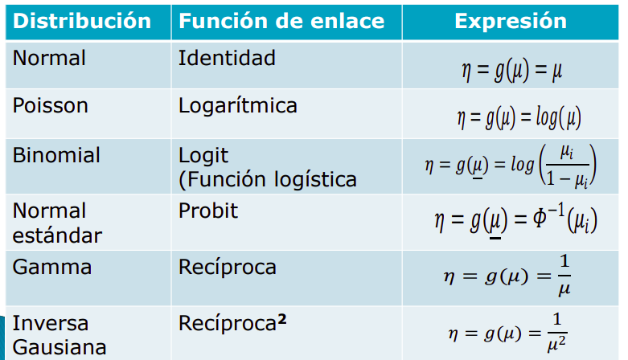
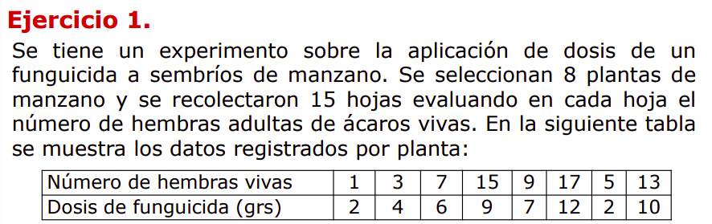
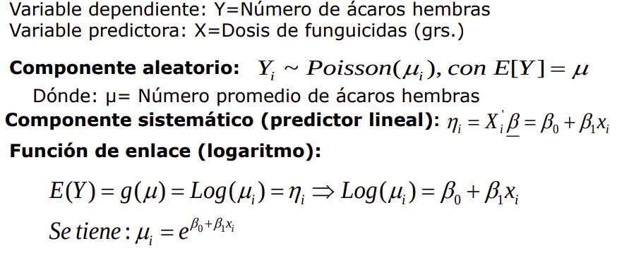
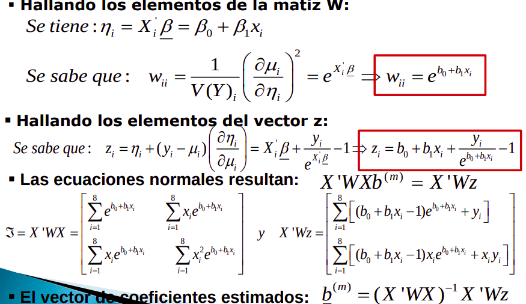

```{r setup, include=FALSE}
library(dplyr)
knitr::opts_chunk$set(echo = TRUE)
knitr::opts_chunk$set(comment = NA)
knitr::opts_chunk$set(warning = F)
knitr::opts_chunk$set(message = F)
```

# Modelos principales

- Principales:



# Caso 1 



## a) Formule el MLG, ajustando los datos a una regresión Poisson con función de enlace logaritmo.   





## b) Determine las expresiones de los estimadores de MV por el método iterativo scoring. Presente las ecuaciones normales.



## c) Halle los estimadores use valores iniciales b(0)=[0.8, 0.1] y para obtener las 5 primeras iteraciones.

- data 

```{r}
y<-c(1,3,7,15,9,17,5,13)
X<-cbind(X0=c(1,1,1,1,1,1,1,1), X1=c(2,4,6,9,7,12,2,10))
```

- Matriz W

```{r}
n=dim(X)[1]
p=dim(X)[2]
W<-matrix(0,nrow=n,ncol=n)
W %>% glimpse
```

- Valores iniciales e iteraciones

```{r}
b<-c(0.8, 0.1)
m=5
```

- Iterando

```{r}
for(i in 0:m){
cat("Iteracion = ",i," Coeficientes estimados: ",b,"\n")
# Estimacion MV con el algoritmo Scoring
Xb=b[1]+b[2] %*% X[,2]
wii<-exp(Xb) + diag(W)
z<-Xb+y*exp(-(Xb))-1
#b<-solve(t(X)%*%W%*%X)%*%(t(X)%*%W%*%t(z))
}

```


## d) Halle las matrices de las ecuaciones normales, la matriz de información y los coeficientes estimados finales.

```{r}
XWX=t(X)%*%W%*%X; XWX
#XWz=t(X)%*%W%*%z; XWz

```


## e) Halle intervalos del confianza del 95% para los coeficientes de regresión.


